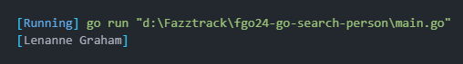

# Search Person in Slice of Strings

This project demonstrates how to iterate over a slice of strings in Go and search for values matching a given parameter. It's a simple exercise to practice string manipulation and searching in the Go programming language.

## Preview



## How to Run This Project

1. Clone the repository:
   ```bash
   git clone https://github.com/VsalCode/fgo24-go-search-person.git
   ```

2. Navigate to the project folder:
   ```bash
   cd fgo24-go-search-person
   ```

3. run the program:
   ```bash
   go run main.go
   ```


## How to Contribute
Pull requests are welcome! For major changes, please open an issue first to discuss your proposed changes. Ensure tests are updated as needed.

## License
[MIT](https://opensource.org/license/mit)
